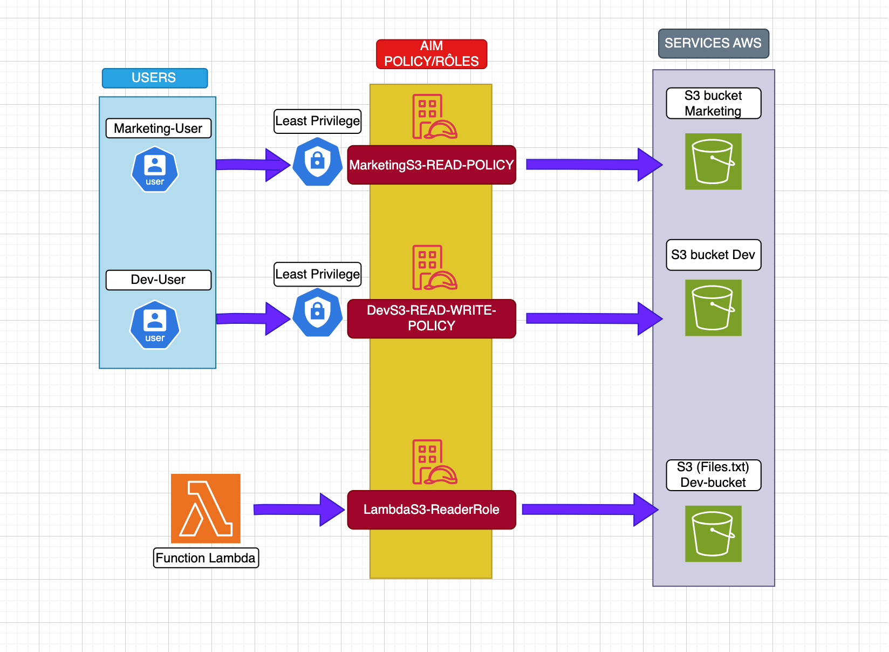

# 🛡️ Secure IAM Playground – AWS Identity & Access Management Lab

## 🎯 Objectif

Ce projet a pour but de démontrer la mise en œuvre d’une stratégie IAM sécurisée dans AWS à travers un laboratoire pédagogique.  
Il met en application les **principes de moindre privilège**, la **gestion des identités**, des **rôles IAM**, et l’accès à des ressources AWS via **des permissions finement contrôlées**.

---

## 🧱 Architecture




---

## 🔐 Composants du projet

| Composant | Description |
|----------|-------------|
| `marketing-user` | Utilisateur IAM avec accès **lecture seule** à un bucket S3 |
| `dev-user` | Utilisateur IAM avec accès **lecture/écriture** à un autre bucket |
| `LambdaS3ReaderRole` | Rôle IAM utilisé par une fonction Lambda pour lire un fichier S3 spécifique |
| `testLambdaS3Reader` | Fonction Lambda sécurisée par rôle IAM |
| `dev-bucket-lionel` | Bucket S3 avec fichier `test2.txt` protégé par IAM |

---

## 📁 Structure du projet

```bash
secure-iam-playground/
├── README.md
├── diagram/
│   ├── secure_iam_playground.drawio
│   └── secure_iam_playground.png
├── policies/
│   ├── marketing_list_only.json
│   ├── dev_rw_policy.json
│   └── lambda_s3_reader.json
├── screenshots/
│   └── [captures IAM + Lambda]
└── lambda/
    └── lambda_function.py
